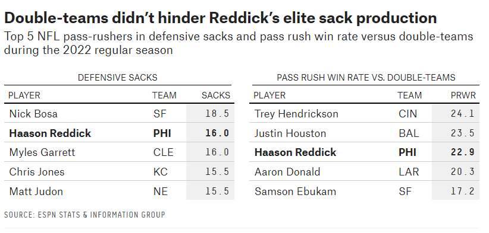

| [Back to Home Page](https://cmustudent.github.io/tswd-portfolio-templates/) | [Visualizing Debt](visualizing-government-debt) | [Critique by Design](critique-by-design) | [final project I](final-project-part-one) | [final project II](final-project-part-two) | [final project III](final-project-part-three) |

# Assignment 3 & 4: Critique By Design

## The Original Design
### From Neil Paine and Josh Hermsmeyer's February 1, 2023 FiveThirtyEight article [*Which Stars Are Going To Blow Up In Super Bowl LVII?*](https://fivethirtyeight.com/features/which-stars-are-going-to-blow-up-in-super-bowl-lvii/) 

As a devoted Philadelphia Eagles fan, I have a vested interest in this year's Super Bowl. And as an aspiring data scientist fascinated with the intersection of data and sports, I have a have a vested interested in the cutting-edge sports analytics from FiveThirtyEight as well. In their article, Neil Paine and Josh Hernsmeyer deep dive into the star players from both the Eagles and their Big Game opponent in the Kansas City Chiefs and accomplish such through a mixed-methods of text and data visualizations. FiveThirtyEight often anticipates its readers to have some knowledge of the topic, statistics, and dataviz and this is the case in the aformentioned work from the two sport writers. 

The specific graphic focuses on the elite production of Haason Reddick and how his defensive totals compare to the NFL's best at getting after the quarterback. The Eagles premier pass-rusher is the sole player in both the top five players in defensive sacks and top five in pass rush win rate versus double-team blocking schemes (e.g. a more advanced metric to evaluate how strong, fast, and elusive a defensive player is). This data is displayed in a compact table with strategic white space, gray shading to underscore the data, proper column labels, an informative title, and bold typeface to highlight Reddick's production. Despite the informative nature of the table, the comparative element of the data and visualization aesthetics are lacking. It is difficult to compare Reddick against his contemporaries as defensive stats for both sacks and win rate are not included for all the players, excluding Reddick. Further, comparison in such a static, numerical format devoid of color is not intuitive in the data viz’s current table formation. 

## Wireframe a Re-design Solution

<a href="https://infogram.com/3ff15455-6fba-4b72-9523-fbc1e118d990" style="color:#989898!important;text-decoration:none!important;" target="_blank">Cardinal Wireframe</a> <a href="https://infogram.com" style="color:#989898!important;text-decoration:none!important;" target="_blank" rel="nofollow">Infogram</a>

Based on the lacking comparative and aesthetic elements, I would add defensive sacks (x-axis) and pass rush win rate versus double-teams (y-axis) data for all nine NFL players included and display them in an interactive scatterplot emphasizing Reddick’s data positioning with strategic use of color. 
