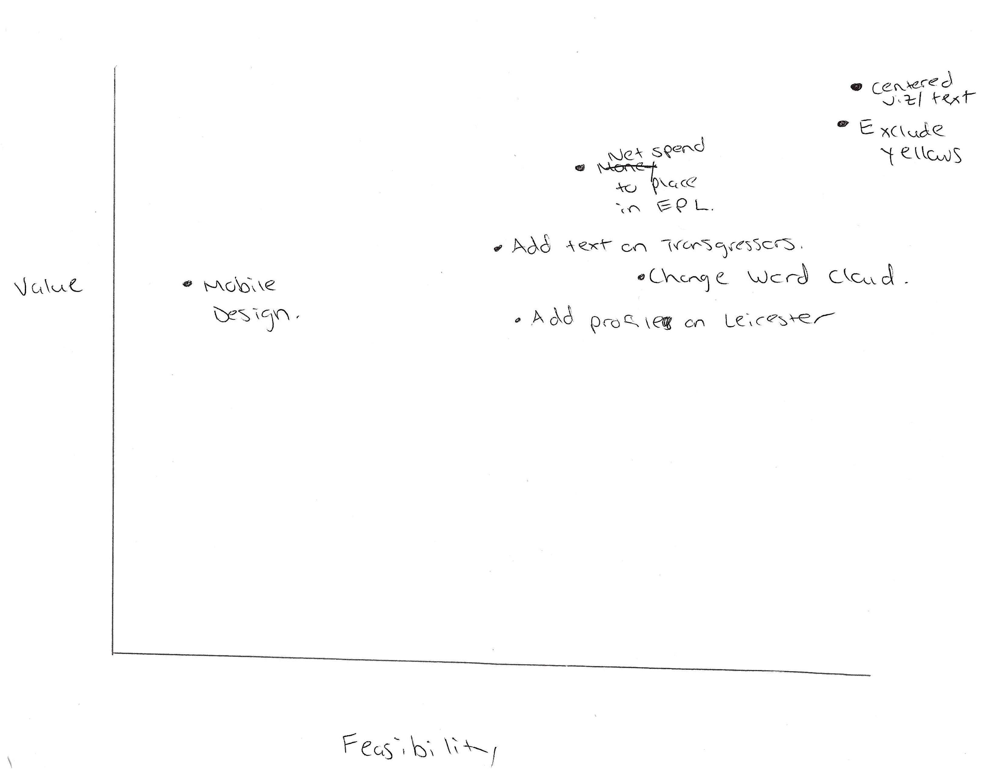

| [home page](https://cmustudent.github.io/tswd-portfolio-templates/) | [visualizing debt](visualizing-government-debt) | [critique by design](critique-by-design) | [final project I](final-project-part-one) | [final project II](final-project-part-two) | [final project III](final-project-part-three) |

# The Final Data Story
Read the final Shorthand story entitled, "Sportswashing: Money Over Culture" [here](https://carnegiemellon.shorthandstories.com/sportswashing-money-over-culture/index.html)

# Changes Made Since Part II
To alleviate some of the stress of the learning curve of Shorthand and dataviz, I created an impact versus feasibility visualization to prioritize my changes outlined in the user feedback from Part II. 

Per the above image, I began making changes from the upper right corner and worked my way down in a southwestern movement to maximize the most feasible for me/impactful changes for the audience. Firstly, I altered the previously snaking orientation of the text and dataviz in Shorthand to be more centered and therefore minimize eye travel when viewing the story. I then changed the yellows in my dataviz to the dark bluish-green indicative of the color [palette](https://coolors.co/palette/56445d-548687-f4d35e) both to emphasize data points in my various viz (e.g. the "Diversification of Ownership in the EPL" donut chart) and further improve the aesthetic design decisions in the final project. The final design decision I made was a necessary choice to avoid copyright infrigement, which involved changing images sourced from Instagram (the "Celebrity Investors in Soccer" viz) to embedding Getty images with links and credits to their photographers and licensing. 

The next change point, "net spend to place in EPL," was in reference to the initial wireframe showing the top revenue earners in soccer regardless of league. Many of the interviewees did not understand its inclusion so I decided to alter the viz and make it more narrow in scope and conducive to the EPL narrative. Initially, I began compiling data on transfer spending and respective finishes in the league table to the usual correlation that more money spent on players usually translates to more success on the field (e.g. Yankees and Dodgers in the MLB context). But I then shifted my focus from standings to total transfer (player) expenditures for all clubs in the Premier League's 31 year history to underscore how much spending habits have changed over time--especially, changing in 2003 with Roman Abramovich's sportswashing takeover of Chelsea. 

Similar to the narrative tightening on the EPL, I decided to outright delete the confusing Word Cloud and survey data of the Saudi purchase of Newcastle United. I thought the story would be tighter without the inclusion of viz literally clouding the story so I put descriptive text in their place. The same can be said for the "add text on transgressors" and "add profile on Leicester" points where I decided to outright delete the background on historical sportswashing attempts outside of the EPL context and instead detail and visualize the four main culprits of sportswashing ownership as well as a counter casestudy in the EPL. 

To bolster the synthesis of the data and story, I added a few more visualizations. In the "Investment in Football" intro, I added a visualization comparing the net worth of the most valuable EPL clubs to iconic American NBA teams to contextualize how big of a business the EPL is on the global stage. I then added a viz for each of the sportswashing trangressors to underscore the impact their purchases have made on the legacy of their clubs in spite of their human rights abuses. Similarly, I added visualizations and call-out-statistics for the case study on Leicester City as an example of benevolent foreign investment. Finally, I built out a more deliberate call to action section with links to articles and websites for more information on how fans can protest the ongoing sportswashing attempts in the EPL.

## The Audience
My audience of American EPL fans remained the same in the final iteration of the Shorthand story. To primarily address the needs of the audience, I added the sections specifically outlining the transgressors of sportswashing in the league, the contrast case of Leicester City, and their accompanying visualizations per the instruction of my one interviewee who fit the target demographic. 

## References
To locate my references, please refer to the end section of the [Shorthand story](https://carnegiemellon.shorthandstories.com/sportswashing-money-over-culture/index.html). 

# Final Thoughts
Despite some nervy moments of stress and frustration from the learning curves of data visualization software, I really enjoyed working on this project. If given more time, I would have added standardized dataviz profiles delinearing the sportswashing aggressors (e.g. their spikes in net spending). Also, I intended for the bar chart race of historical spending from the EPL to be a cumulative count rather than a year to year comparison but could not troubleshoot the viz on Flourish per timing constraints. I do believe the call-out statistic of total expenditures helped overcome this visual shortcoming. Ultimately, I would have liked to build my visualizations in Tableau; however, my relative familarity with Flourish allowed for quicker production of viz to deliver the final project. With a stronger grasp of data visualization building, I will certainly try my hand at Tableau in the future! 

